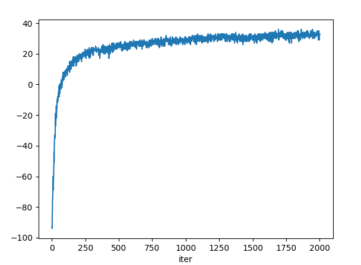
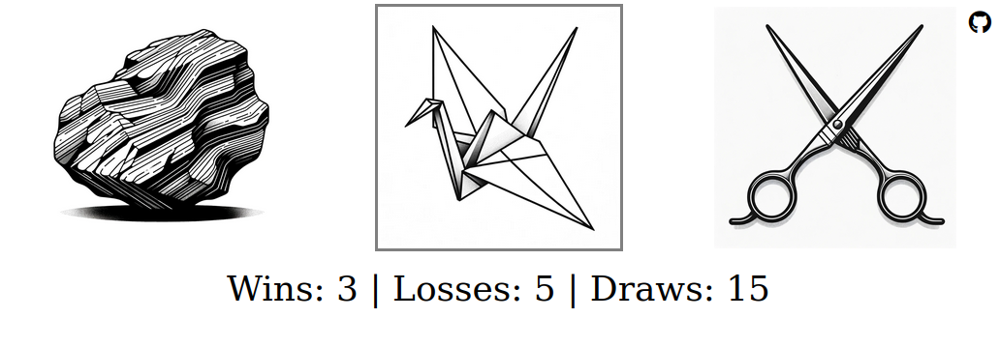

# RobotShamBo


## Introduction

RobotShamBo aims to explore the capabilities of neuro-evolution applied to the classic game of Rock-Paper-Scissors. This project employs various forms of neural networks to model intelligent agents and observes how they evolve to play the game more optimally.

This project uses an implementation of Iocaine Powder, the [winning solution](https://web.archive.org/web/20110810213237/http://webdocs.cs.ualberta.ca/~darse/rsb-results1.html) of the first edition of the international RoShamBo competition.
The neural networks are evaluated using their performance against Iocaine Powder, and steadily learn to outperform it.

One idea I am experimenting with is that the rewards for winning with Rock, Paper, or Scissors are *configurable*, and do not have to be equal.
So far, it appears that injecting some form of asymmetry in the rewards might help the population escape from the [Nash equilibrium](https://en.wikipedia.org/wiki/Nash_equilibrium) strategy of always choosing randomly.
This is because if one player chooses the pure random strategy, the other player can beat it by always playing the choice with the highest reward.
And that in turn can be countered by whatever beats that choice, etc.. etc.. by removing a simple and stable behavior that (originally) could not be exploited,
that dead end attractor is removed from the [fitness landscape](https://en.wikipedia.org/wiki/Fitness_landscape).

An example of improved fitness over 2000 generations vs Iocaine Powder and asymmetric rewards:



## Installation

Clone the repository:

```
git clone https://github.com/evolvingstuff/RobotShamBo.git
```

Navigate to the project directory and install the required packages:

```
cd RobotShamBo
pip install -r requirements.txt
```

## Usage

To run the main program (the evolutionary loop):

```
python main.py
```

To play against the evolved champion in a web app:

```
python simulate_web_app.py
```

and navigate to [http://localhost:8080/](http://localhost:8080/).



__**You can try out an online demo [here](http://146.190.12.216:8080/).**__

## Features

- [x] **Evolutionary Algorithms**: Use evolutionary algorithms (currently configured with SNES) to evolve optimal decision-making strategies.
- [x] **Neural Networks**: Utilize various architectures (currently LSTM, but plan to add Transformers, CNNs, etc..)
- [x] **Simulation web app**: Interactive mode to play against the evolved champion in the browser.


## TODO

- [ ] **Vectorization / GPU support**
- [ ] **Reinforcement Learning**: Train agents using popular RL algorithms like Q-Learning and DQN.
- [ ] **Visualization**: Tools for visualizing decision-making strategies and their evolution over time.


## Libraries Used

- **EvoTorch**: This project relies on the EvoTorch library for various evolutionary algorithms in Torch. 
  - **License**: Apache License 2.0. You can view the full license details in the [EvoTorch repository](https://github.com/nnaisense/evotorch/blob/master/LICENSE).
  - **Repository**: [EvoTorch GitHub](https://github.com/nnaisense/evotorch)


## License

This project is licensed under the MIT License. See the [LICENSE](LICENSE) file for details.

## Acknowledgments

- **Iocaine Powder Algorithm Implementation**: This project makes use of the Iocaine Powder algorithm as found [here](http://davidbau.com/downloads/rps/rps-iocaine.py), by [David Bau](http://davidbau.com/). This is, in turn, an adaptation of the original code/algorithm, written by Dan Egnor. I have made modifications to fit the requirements of the RobotShamBo project.
- **Images** generated by [DALL-E 3](https://openai.com/dall-e-3)
